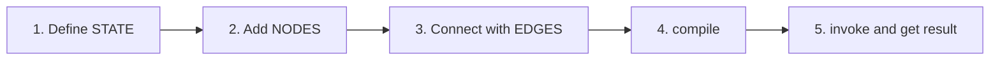
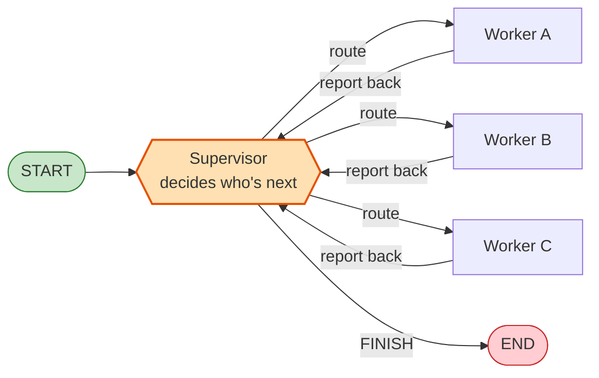
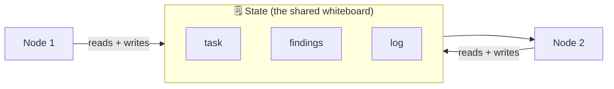
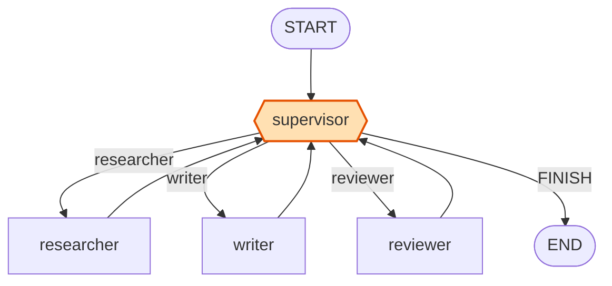
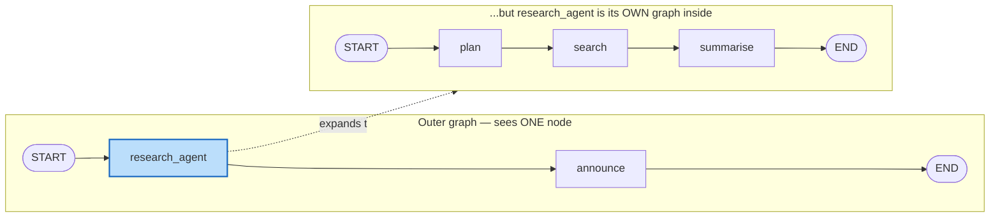
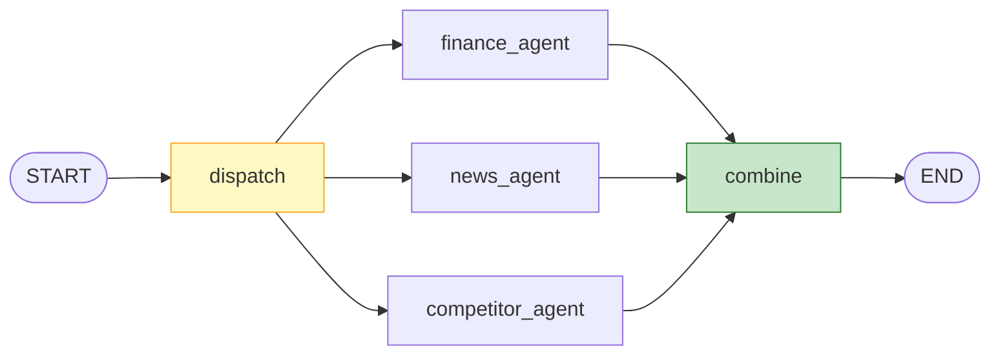
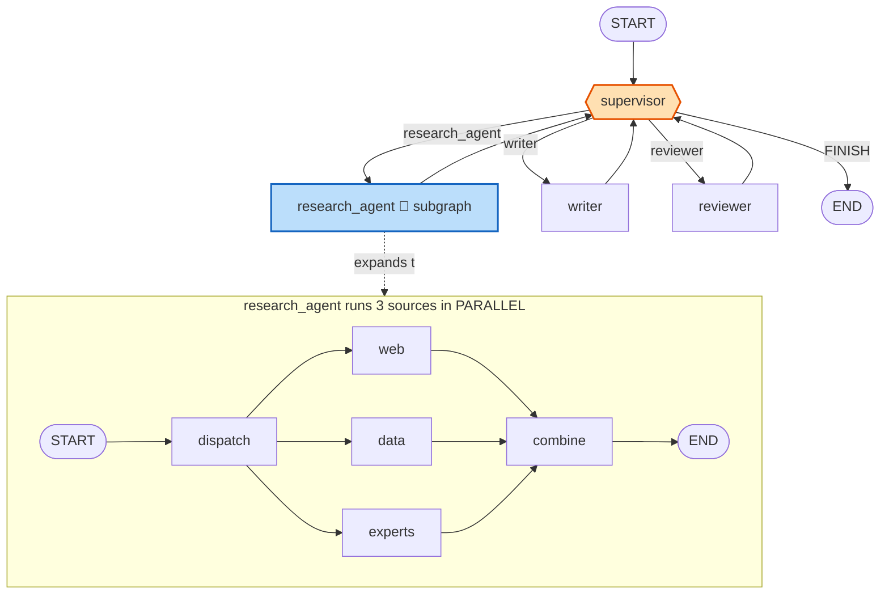
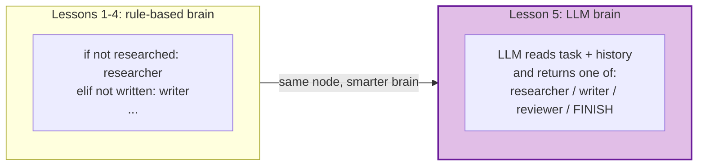

# Multi-Agent Systems with LangGraph — a beginner's course

> **For instructors *and* absolute beginners.** This guide assumes you have
> never used LangGraph before. It explains every idea in plain language, with
> diagrams you can put on screen and code you can run. Diagrams are written in
> **Mermaid** — they render automatically in VS Code's Markdown preview
> (`Ctrl+Shift+V`) and on GitHub.

**What you will learn**

1. **Supervisor node & routing logic** — one "team lead" node that decides who works next.
2. **Agent hand-off & task delegation** — how work passes between agents.
3. **Subgraph as a reusable agent component** — build an agent once, reuse it anywhere.
4. **Parallel execution** — run independent agents at the same time.

Lessons 1–4 need **no API key** (we use simple rules instead of an LLM) so the
whole class can run everything and focus on *how the graph works*. Lesson 5 adds
a real LLM at the end.

---

## Part 0 · What is LangGraph, in plain words?

Imagine you want several AI "workers" to cooperate on a task — one researches,
one writes, one reviews. You need a way to describe:

- **who the workers are** (nodes),
- **how work flows between them** (edges),
- **what information they share** (state).

**LangGraph is a library for drawing that flow as a graph and then running it.**

Three words you'll hear constantly:

| Word | Plain meaning | Kitchen analogy 🍳 |
|------|---------------|--------------------|
| **Node** | A step that does some work. Just a Python function. | A cook at one station |
| **Edge** | An arrow saying "after this step, go to that step." | "Pass the plate to the next station" |
| **State** | The shared data every node can read and write. | The order ticket everyone reads |

That's the whole mental model. A LangGraph program is: *define the state → add
nodes → connect them with edges → compile → run.*



---

## Part 1 · Setup (do this once)

```bash
cd multi-agent-parallel-execution
uv venv                       # creates an isolated Python environment
uv pip install -r requirements.txt
```

Run any lesson like this:

```bash
uv run lesson_01_supervisor_routing.py
```

> No `uv`? You can also use plain `pip install -r requirements.txt` and
> `python lesson_01_supervisor_routing.py`.

---

## Part 2 · The one picture that explains everything

Show this first. Every lesson is a variation of it.



**Say this out loud:** "The supervisor is the *only* node that decides who works
next. Each worker does its job, then reports **back** to the supervisor. The
supervisor keeps looping until it decides we are `FINISH`ed."

Why is this design so popular? Because **one place makes all the decisions**. If
something goes wrong, you know exactly where to look. It's the easiest
multi-agent pattern to understand and debug — perfect for beginners.

---

## Part 3 · Five mental models (write these on the board)

These five ideas explain 90% of everything you'll see. We'll revisit each one in
the lessons.

### Mental model 1 · The State is a shared whiteboard 🗒️

Every node reads the whiteboard, does a little work, and writes back. LangGraph
carries that whiteboard from node to node. Nodes never talk to each other
directly — they only read and write the shared state.



In code, the whiteboard is a `TypedDict` — just a dictionary with named fields:

```python
from typing import TypedDict

class TeamState(TypedDict):
    task: str          # the original request
    log: list[str]     # what has happened so far
    next: str          # who the supervisor chose to run next
```

A node is a function that **receives the state and returns the fields it wants to
change**:

```python
def researcher(state: TeamState) -> dict:
    # read from state...
    print("researching:", state["task"])
    # ...return ONLY the fields you want to update
    return {"log": ["researcher: found 3 facts"]}
```

You don't return the whole state — just the changes. LangGraph merges them in.

### Mental model 2 · A "reducer" tells LangGraph how to MERGE writes

When a node returns `{"log": ["step 2"]}`, LangGraph has to decide: *replace* the
old `log`, or *combine* with it? A **reducer** is the rule that answers this.

- **No reducer (default) → replace.** New value overwrites the old one.
- **With a reducer → merge.** For example, append the new list to the old list.

You attach a reducer using `Annotated`:

```python
from typing import Annotated
import operator

class TeamState(TypedDict):
    log: Annotated[list[str], operator.add]   # <-- reducer = operator.add
```

`Annotated[list[str], operator.add]` reads as: *"the type is `list[str]`, and
when merging, combine with `operator.add`."* For lists, `operator.add` means
concatenate: `["a"] + ["b"]` → `["a", "b"]`.

```
Without reducer (replace):        With operator.add (merge):
  old: ["step 1"]                   old: ["step 1"]
  new: ["step 2"]                   new: ["step 2"]
  ───────────────                   ───────────────
  result: ["step 2"]  ❌ lost!      result: ["step 1", "step 2"]  ✅
```

> The word "reducer" comes from the `reduce()` idea in programming: repeatedly
> folding new values into one accumulated result — exactly what happens as each
> node adds its update to the running state.

**You will see why this is essential in Lesson 3**, where parallel nodes all
write to the same field at the same time.

### Mental model 3 · The supervisor is the only node that picks the next step

Workers never choose who runs after them. They just do work and return to the
supervisor. This keeps the control flow in one place and easy to follow.

### Mental model 4 · A compiled graph is reusable as a node 🧱

When you finish building a graph and call `.compile()`, you get an object that
behaves **exactly like a single node**. So you can drop a whole graph *inside
another graph* as if it were one step.

Why does this work? In LangGraph, a node is just *"something that can be run"* —
it takes state in and returns updates. A compiled graph does exactly that too, so
from the outside you can't tell a simple function apart from an entire graph:

```
   state in  ──►  [ ??? ]  ──►  state out
```

That `[ ??? ]` could be a one-line function *or* a 10-node graph.

```python
research_agent = build_research_agent()   # returns a compiled graph

# Use it on its own, like any app:
research_agent.invoke({"topic": "bees", ...})

# OR drop the WHOLE graph into a bigger graph as ONE node:
outer.add_node("research_agent", research_agent)   # ← the magic line
```

This is what makes agents **reusable Lego bricks**: build once, reuse everywhere,
test in isolation, and nest simple parts into complex systems. **You'll see this
live in Lesson 2.**

### Mental model 5 · Edges create parallelism — not the node code

If one node has **three outgoing edges**, those three targets run **in parallel**.
When several edges point **into** one node, that node waits for all of them
(this is called "fan-in") and then runs once. You don't write any threading code
— you just draw the edges. **You'll see this in Lesson 3.**

---

# LESSON 1 · Supervisor + routing

📄 `lesson_01_supervisor_routing.py`

### What we're building

A tiny content team: a **researcher**, a **writer**, and a **reviewer**, all
managed by a **supervisor**. The supervisor sends work to one worker at a time,
and each worker reports back.



### The key ideas (hand-off & delegation)

- **Delegation:** the supervisor picks one worker and gives it the task.
- **Hand-off:** the worker finishes and **hands control back** to the supervisor.
- **Re-planning:** because control always returns, the supervisor can adapt its
  next choice based on what's been done so far.

### How the code works, piece by piece

**1. The supervisor decides — and writes its choice into the state:**
```python
def supervisor(state):
    # simple rules: research first, then write, then review, then finish
    if not any("researcher" in s for s in state["log"]):
        decision = "researcher"
    elif not any("writer" in s for s in state["log"]):
        decision = "writer"
    ...
    return {"next": decision}    # store the choice on the whiteboard
```

**2. A router function reads that choice and returns where to go:**
```python
def route_from_supervisor(state):
    if state["next"] == "FINISH":
        return END
    return state["next"]      # e.g. "researcher"
```

**3. We wire it up with a *conditional edge*** — an edge that changes direction
based on a function's return value:
```python
graph.add_conditional_edges(
    "supervisor",
    route_from_supervisor,
    {"researcher": "researcher", "writer": "writer",
     "reviewer": "reviewer", END: END},
)
```

**4. Every worker edges *back* to the supervisor** — this is the loop:
```python
for worker in WORKERS:
    graph.add_edge(worker, "supervisor")
```

### Run it

```bash
uv run lesson_01_supervisor_routing.py
```

### Expected output

```
[supervisor] task='Write a short article about bees' -> next = researcher
  [researcher] gathering facts...
[supervisor] ... -> next = writer
  [writer] drafting content...
[supervisor] ... -> next = reviewer
  [reviewer] checking quality...
[supervisor] ... -> next = FINISH
```

**Ask the class:** "Who decided the order of work?" → the supervisor, every time.
The workers just did their jobs.

---

# LESSON 2 · Subgraph as a reusable agent

📄 `lesson_02_subgraph_agent.py`

### The problem it solves

A real agent usually has several internal steps (think → act → check). Cramming
all of that into one node gets messy. Instead, we build the agent as its **own
small graph**, then plug that whole graph into a bigger graph as a **single
node**. (This is Mental Model 4 in action.)



### How the code works

**1. Build the agent as a normal graph and compile it:**
```python
def build_research_agent():
    sub = StateGraph(State)
    sub.add_node("plan", plan)
    sub.add_node("search", search)
    sub.add_node("summarise", summarise)
    sub.add_edge(START, "plan")
    sub.add_edge("plan", "search")
    sub.add_edge("search", "summarise")
    sub.add_edge("summarise", END)
    return sub.compile()     # ← returns a reusable "runnable"
```

**2. Use that whole graph as one node in a bigger graph:**
```python
research_agent = build_research_agent()
outer.add_node("research_agent", research_agent)   # the whole graph, as one node
```

### One thing to remember

For a subgraph to slot in cleanly, the inner and outer graphs should **agree on
the state fields** the subgraph reads and writes. In this lesson we keep it
simple by using the **same `State` shape** for both — the easiest approach for
beginners.

### Run it

```bash
uv run lesson_02_subgraph_agent.py
```

The script runs the agent **standalone first**, then **embedded** in a bigger
graph — the *same code*, used in two contexts. That's the whole lesson: **one
agent, reusable as a building block.**

---

# LESSON 3 · Parallel execution (fan-out / fan-in)

📄 `lesson_03_parallel_execution.py`

### The idea

Some work is **independent** and can run at the same time. To research a company,
you can gather its finances, its news, and its competitors all at once — then
combine them. Doing three things at once is faster than one after another.



- **Fan-out:** `dispatch` has 3 outgoing edges → the 3 agents run **in parallel**.
- **Fan-in:** `combine` has 3 incoming edges → it **waits for all 3**, then runs once.

Remember Mental Model 5: **you don't write any threading code.** The parallelism
comes entirely from the shape of the edges.

### Why reducers become essential here

All three agents write to the **same** `findings` field at the same time:

```python
def finance_agent(state):    return {"findings": ["finance: revenue up 12%"]}
def news_agent(state):       return {"findings": ["news: new product line"]}
def competitor_agent(state): return {"findings": ["competitor: 2 rivals"]}
```

If `findings` has **no reducer**, LangGraph sees three simultaneous writes to the
same key, can't decide which one wins, and raises an error. With a reducer, it
merges all three:

```python
findings: Annotated[list[str], operator.add]   # merge = concatenate
# result: ["finance: revenue up 12%", "news: new product line", "competitor: 2 rivals"]
```

### 🔥 A demo that makes reducers unforgettable

1. Run the lesson normally — it works.
2. In `ResearchState`, change this line:
   ```python
   findings: Annotated[list[str], operator.add]
   ```
   to just:
   ```python
   findings: list[str]
   ```
   and run again.
3. LangGraph raises **`InvalidUpdateError`** — because two parallel nodes wrote
   the same key with no merge rule.
4. Put the reducer back. Lesson learned, live.

### Run it

```bash
uv run lesson_03_parallel_execution.py
```

Notice the three agents print in a **different order each time** — that's your
proof they really ran in parallel, not one-by-one.

---

# LESSON 4 · Capstone — all three ideas together

📄 `lesson_04_full_system.py`

This is the payoff. A briefing system that combines **supervisor routing** (L1)
+ **a reusable subgraph agent** (L2) + **parallel execution inside that agent** (L3).



### How to teach it

Run it, then **trace the printed output line-by-line against the diagram**. Ask
students to point at which box is running as each line prints.

```bash
uv run lesson_04_full_system.py
```

**Callouts while tracing:**
- "The supervisor picks `research_agent` — but that's a *whole subgraph* (L2)."
- "Inside it, 3 sources fan out and fan back in (L3)."
- "Control returns to the supervisor (L1), which then picks `writer`, then
  `reviewer`, then `FINISH`."

This is the "everything clicks" moment — three simple ideas composed into one
real system.

---

# LESSON 5 · Make the supervisor SMART with an LLM (optional)

📄 `lesson_05_llm_supervisor.py`  *(needs an OpenAI key)*

### The key message

**The graph shape does NOT change.** We only swap the *inside* of the supervisor
— from hand-written `if` rules to an LLM that reads the situation and decides.



### What "structured output" means

We don't want the LLM to reply with a paragraph we have to parse. We hand it a
**schema** that restricts its answer to exactly our worker names:

```python
from typing import Literal
from pydantic import BaseModel

class Route(BaseModel):
    next: Literal["researcher", "writer", "reviewer", "FINISH"]

router = llm.with_structured_output(Route)   # LLM MUST reply with a valid Route
```

`Literal[...]` means the model literally cannot invent a name outside that list.
No fragile string parsing — you always get one of your four choices.

### Setup (only for this lesson)

1. Create a file named `.env` next to the script:
   ```
   OPENAI_API_KEY=sk-...your key...
   ```
2. Run it:
   ```bash
   uv run lesson_05_llm_supervisor.py
   ```

No key? The script prints instructions and exits cleanly. Lessons 1–4 still work
without any key.

### Discuss

When is an LLM supervisor worth it? → For **open-ended tasks** where you can't
write out every routing rule by hand. For simple, predictable flows, plain rules
are cheaper and more reliable.

---

## Common questions from students

| Question | Answer |
|----------|--------|
| Why does each worker go back to the supervisor? | So the supervisor stays in control and can re-plan after every step. That's the whole point of the *supervisor* pattern. |
| What exactly is a node? | Just a Python function that takes the state and returns the fields it wants to change. |
| What is a reducer again? | A rule for **merging** a node's update with the existing value. Default = replace; `operator.add` on a list = append. Required for parallel writes to the same field. |
| When should I use parallel execution? | Only when tasks are **independent**. If step B needs step A's output, keep them sequential. |
| I got `InvalidUpdateError` — why? | Two parallel nodes wrote the same state field with no reducer. Add `Annotated[list, operator.add]`. |
| Subgraph vs. just adding more nodes? | Use a subgraph when the agent is reusable or complex enough to test on its own. Otherwise plain nodes are fine. |
| How do I stop an accidental infinite loop? | Pass `{"recursion_limit": 20}` to `invoke` (see Lesson 5). LangGraph stops after that many steps. |

---

## Suggested teaching order

1. Part 0–3: explain what LangGraph is, the "one picture," and the five mental models.
2. Lesson 1 — supervisor & routing.
3. Lesson 2 — reusable subgraph.
4. Lesson 3 — parallel execution + the reducer error demo.
5. Lesson 4 — capstone; trace it live against the diagram.
6. Lesson 5 — LLM supervisor + discussion (if keys are available).

---

## File map

```
multi-agent-parallel-execution/
├── README.md                        ← this course guide
├── requirements.txt
├── lesson_01_supervisor_routing.py  ← Concept 1: supervisor + routing
├── lesson_02_subgraph_agent.py      ← Concept 2: reusable subgraph agent
├── lesson_03_parallel_execution.py  ← Concept 3: fan-out / fan-in + reducers
├── lesson_04_full_system.py         ← Capstone: all three combined
└── lesson_05_llm_supervisor.py      ← Optional: real LLM supervisor
```

> **Tip:** open this file in VS Code and press `Ctrl+Shift+V` to see every
> diagram rendered. Project that preview on screen during class.
